# WarmSwarm User Journey Flows

## Three-Tier User System

🎭 **Participant** → Experience swarms
🎨 **Organizer** → Coordinate swarms using templates  
🔧 **Advanced** → Build custom configurations

---

## Complete User Flow Diagram

```mermaid
flowchart TD
    Start[/"🐝 WarmSwarm Home"/]
    
    Start --> ParticipantEntry["🎭 I want to JOIN a swarm"]
    Start --> OrganizerEntry["🎨 I want to CREATE a swarm"]
    Start --> AdvancedEntry["🔧 I want to BUILD custom swarms"]
    
    %% ===== PARTICIPANT PATH =====
    ParticipantEntry --> JoinPage["/join - Enter Invite Code"]
    JoinPage --> JoinValidation{Valid Code?}
    JoinValidation -->|No| JoinError["❌ Show Error"]
    JoinError --> JoinPage
    JoinValidation -->|Yes| SelectRole["Select Role<br/>(Receiver 1-4 or Sender)"]
    SelectRole --> LiveSwarm["/swarm - Live Experience"]
    LiveSwarm --> ParticipantReceive["📺 Receive messages<br/>Audio/Text/Video/TTS"]
    LiveSwarm --> ParticipantSend["📡 Send messages<br/>(if Sender role)"]
    
    %% ===== ORGANIZER PATH =====
    OrganizerEntry --> TemplateSelect["/create/catalogue<br/>Choose Template"]
    TemplateSelect --> LiveTemplate["🔴 LIVE Template<br/>(Immediate coordination)"]
    TemplateSelect --> TimedTemplate["⏱️ TIMED Template<br/>(Scheduled sequence)"]
    
    LiveTemplate --> ConfigureLive["Configure Live Swarm:<br/>• Name<br/>• Description<br/>• Number of receivers<br/>• Privacy settings"]
    ConfigureLive --> SaveLive["💾 Save & Get Invite Code"]
    SaveLive --> ShareInvite["📤 Share invite code<br/>with participants"]
    ShareInvite --> RunLive["/swarm - Run Live Session"]
    RunLive --> SendControl["📡 Send messages to:<br/>• All<br/>• Odd/Even<br/>• Specific receivers"]
    
    TimedTemplate --> ConfigureTimed["Configure Timed Swarm:<br/>• Name<br/>• Description<br/>• Number of receivers<br/>• Privacy settings"]
    ConfigureTimed --> TimelineEdit["/timeline - Edit Sequence"]
    TimelineEdit --> SelectTrack["Select Target Track<br/>(Receiver 1-4)"]
    SelectTrack --> AddEvents["Add Events:<br/>🎵 Audio<br/>📝 Text<br/>🎬 Video<br/>🗣️ TTS"]
    AddEvents --> ArrangeTime["Drag left/right<br/>to adjust timing"]
    ArrangeTime --> MoreEvents{Add more?}
    MoreEvents -->|Yes| SelectTrack
    MoreEvents -->|No| SaveTimed["💾 Save Timeline<br/>& Get Invite Code"]
    SaveTimed --> ShareInvite
    
    %% ===== ADVANCED PATH =====
    AdvancedEntry --> AdvancedCatalogue["/create/catalogue/swarms<br/>Full Constellation Builder"]
    
    AdvancedCatalogue --> Step1Concept["1️⃣ CONCEPT<br/>Define swarm purpose"]
    Step1Concept --> Step2Content["2️⃣ CONTENT<br/>Upload/Link media files<br/>(Audio, Video, Text, TTS)"]
    Step2Content --> Step3Constellation["3️⃣ CONSTELLATION<br/>Define roles & relationships<br/>• Senders<br/>• Receivers<br/>• Groups"]
    Step3Constellation --> Step4Coordination["4️⃣ COORDINATION<br/>Build event timeline<br/>• Multi-track sequencing<br/>• Conditional triggers<br/>• Interactive branches"]
    Step4Coordination --> Step5Configuration["5️⃣ CONFIGURATION<br/>• Network settings<br/>• WebRTC options<br/>• Database schema<br/>• API endpoints"]
    Step5Configuration --> SaveAdvanced["💾 Save as Template"]
    SaveAdvanced --> TemplateChoice{Make Public?}
    TemplateChoice -->|Yes| PublicTemplate["📢 Add to public templates"]
    TemplateChoice -->|No| PrivateTemplate["🔒 Keep private"]
    PublicTemplate --> UseAdvanced["Run or share custom swarm"]
    PrivateTemplate --> UseAdvanced
    
    %% Styling
    classDef participantStyle fill:#667eea,stroke:#5568d3,color:#fff
    classDef organizerStyle fill:#f093fb,stroke:#e74c3c,color:#fff
    classDef advancedStyle fill:#764ba2,stroke:#5e3a80,color:#fff
    classDef pageStyle fill:#2ecc71,stroke:#27ae60,color:#fff
    classDef actionStyle fill:#3498db,stroke:#2980b9,color:#fff
    
    class ParticipantEntry,JoinPage,LiveSwarm,ParticipantReceive,ParticipantSend participantStyle
    class OrganizerEntry,TemplateSelect,LiveTemplate,TimedTemplate,ConfigureLive,ConfigureTimed,TimelineEdit organizerStyle
    class AdvancedEntry,AdvancedCatalogue,Step1Concept,Step2Content,Step3Constellation,Step4Coordination,Step5Configuration advancedStyle
    class SelectRole,SaveLive,SaveTimed,SaveAdvanced,ShareInvite pageStyle
    class AddEvents,ArrangeTime,SendControl actionStyle
```



---

## Path Summaries

### 🎭 Participant Path (Simplest)
**Goal:** Join and experience a swarm

**Steps:**
1. Click "Join a Swarm" from home
2. Enter invite code
3. Select role (Receiver 1-4 or Sender)
4. Experience the swarm in real-time

**Pages Used:** `/join` → `/swarm`

---

### 🎨 Organizer Path (Template-Based)
**Goal:** Quickly create and coordinate a swarm using pre-built templates

**Live Swarm Flow:**
1. Choose "Create a Swarm"
2. Select LIVE template
3. Configure basic settings (name, receivers, privacy)
4. Save and get invite code
5. Share with participants
6. Coordinate live using sender controls

**Timed Swarm Flow:**
1. Choose "Create a Swarm"
2. Select TIMED template
3. Configure basic settings
4. Open timeline editor
5. Select target track and add events
6. Arrange timing by dragging
7. Save timeline and get invite code
8. Share with participants
9. System auto-plays the sequence

**Pages Used:** `/create/catalogue` → `/timeline` (if timed) → `/swarm`

---

### 🔧 Advanced Path (Full Custom Build)
**Goal:** Build completely custom swarm configurations from scratch

**The 5 C's Workflow:**
1. **CONCEPT** - Define purpose, goals, and outcomes
2. **CONTENT** - Create/upload all media assets
3. **CONSTELLATION** - Design complex role structures and relationships
4. **COORDINATION** - Build sophisticated timeline with triggers and branches
5. **CONFIGURATION** - Set technical parameters (network, WebRTC, database)

Can save as template for future use or make public for others.

**Pages Used:** `/create/catalogue/swarms` → `/create/constellation` → `/timeline` → `/swarm`

---

## Key Design Principles

### Progressive Disclosure
- **Participants** see the least complexity (just join + experience)
- **Organizers** see template choices with simple customization
- **Advanced** users see full power with all technical options

### Common End Point
- All three paths converge at `/swarm` for the live experience
- Different entry points but same execution environment
- Role-based UI adapts to user's permissions

### Template Hierarchy
```
Public Templates (Anyone can use)
    ↓
My Templates (Advanced users create)
    ↓
Active Swarms (Any template in use)
```

---

## Navigation Structure

```mermaid
flowchart LR
    Home["🏠 Home<br/>(warmswarm.org)"]
    
    Home --> Join["🎭 Join<br/>(/join)"]
    Home --> Create["🎨 Create<br/>(/create/catalogue)"]
    Home --> Build["🔧 Build<br/>(/create/constellation)"]
    Home --> Explore["🔍 Explore<br/>(/swarms)"]
    Home --> About["ℹ️ About<br/>(/about)"]
    
    Create --> Timeline["⏱️ Timeline<br/>(/timeline)"]
    Build --> Timeline
    
    Join --> Swarm["🐝 Swarm<br/>(/swarm)"]
    Create --> Swarm
    Build --> Swarm
    Explore --> Swarm
    
    style Home fill:#667eea,color:#fff
    style Join fill:#2ecc71,color:#fff
    style Create fill:#f093fb,color:#fff
    style Build fill:#764ba2,color:#fff
    style Swarm fill:#e74c3c,color:#fff
```



---

## Next Steps for Implementation

### Phase 1: Core Participant Experience ✅
- [x] `/join` page with invite code entry
- [x] `/swarm` page with Live chat
- [x] Role selection (Sender/Receivers 1-4)
- [x] Socket.IO real-time messaging

### Phase 2: Organizer Templates (In Progress)
- [x] Timeline editor (`/timeline`) ✅
- [x] Track selector with visual highlighting ✅
- [ ] Template selection page
- [ ] Live vs Timed template distinction
- [ ] Simple configuration UI for Organizers

### Phase 3: Advanced Builder
- [ ] `/create/constellation` - full 5 C's workflow
- [ ] Content library management
- [ ] Complex role/group definitions
- [ ] Conditional triggers in timeline
- [ ] Technical configuration panel
- [ ] Save as public/private template

### Phase 4: Polish & Integration
- [ ] Template marketplace
- [ ] My Swarms dashboard
- [ ] Analytics and insights
- [ ] Mobile optimization
- [ ] Export/import swarm configs

---

## User Personas

### 👤 Sarah - The Participant
**Goal:** Join a meditation swarm created by her yoga instructor
- Enters invite code from email
- Selects "Receiver 2" as assigned
- Receives audio cues and text prompts in sync with group
- **Needs:** Dead simple, no setup, just works

### 👤 Marcus - The Organizer
**Goal:** Run a team-building exercise with 4 groups
- Chooses "Timed - Team Challenge" template
- Customizes: 4 receivers, 45-minute sequence
- Uses timeline to schedule: intro → challenge prompts → wrap-up
- Shares invite with 20 participants (5 per receiver group)
- **Needs:** Fast setup, visual timeline, reliable delivery

### 👤 Dr. Chen - The Advanced User
**Goal:** Build a research study on group decision-making
- Creates custom constellation with complex role structures
- Uploads 50 audio files, 20 videos, 100 text prompts
- Programs conditional branches based on participant responses
- Configures data collection and export
- Publishes as template for other researchers
- **Needs:** Full control, technical flexibility, reusability


